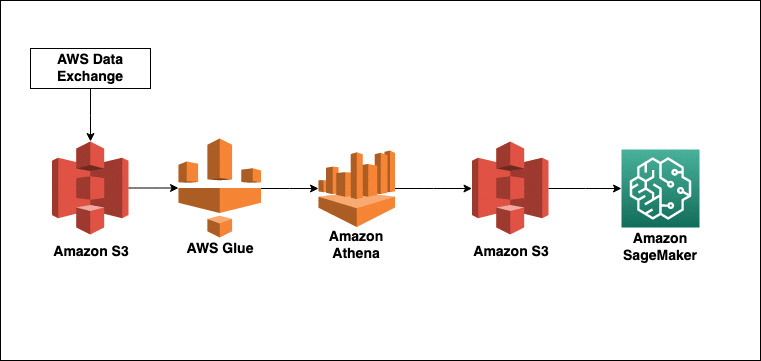

# AI-powered-data-pipeline
AI-Powered Data Pipeline with AWS Glue, S3, Athena, and SageMaker
# AI-Powered Data Pipeline with AWS Glue, S3, Athena, and SageMaker

This project builds a serverless, AI-powered data pipeline using AWS Glue for ETL (Extract, Transform, Load), Amazon S3 for data storage, AWS Athena for querying, and Amazon SageMaker for machine learning tasks.

## Architecture

The architecture includes the following AWS services:
- **AWS Glue**: For ETL jobs to process and transform data.
- **Amazon S3**: For storing raw and processed data.
- **AWS Athena**: For querying data stored in S3 using SQL.
- **Amazon SageMaker**: For training machine learning models and deploying them.

## Services Used:
- **AWS Glue**
- **Amazon S3**
- **AWS Athena**
- **Amazon SageMaker**
- **AWS Lambda** (for orchestration)
- **AWS Step Functions** (for workflow orchestration)

